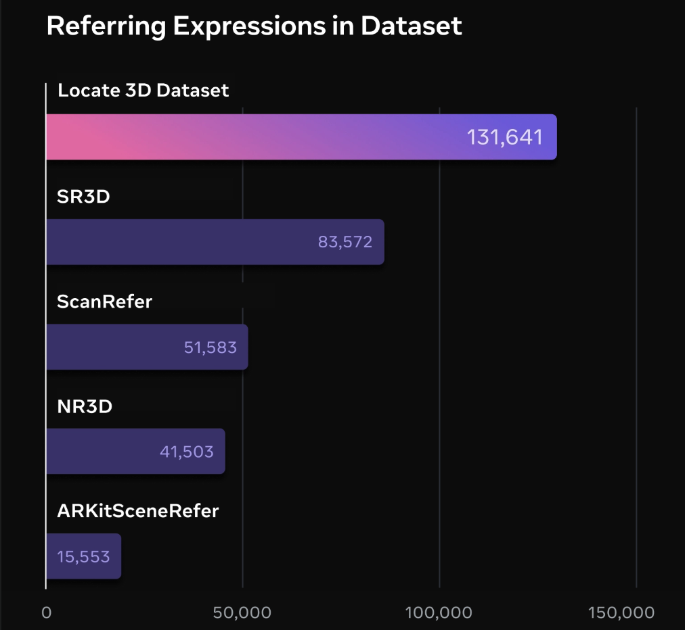

# Locate 3D Dataset


### What is the dataset?
Locate 3D Dataset (L3DD) is a new human-annotated referring expression dataset, much like [ScanRefer](https://daveredrum.github.io/ScanRefer/) or [NR3D](https://referit3d.github.io/). It contains 131,641 samples and covers ScanNet (v2), ScanNet++ (v1), and ARKitScenes. L3DD is the first 3D RefExp dataset to cover multiple scene datasets and is by far the largest human-annotated 3D RefExp dataset.

When added to ScanRefer, SR3D, and NR3D, this data yielded around a 2% performance increase to model performance on existing benchmarks. Further, because our evaluation set spans multiple scene datasets, it can be used to accurately gauge the scene generalization capabilities of a 3D language grounding model.

### How is the dataset structured?
We closely mirror the structure of [ScanEnts3D-NR3D](https://scanents3d.github.io/). The dataloader we share also accepts a ScanEnts3D-NR3D JSON as input. We share a single JSON for each pair of scene dataset and split. For example, one JSON may contain all of the data for ScanNet on validation scenes. Each JSON is a list of samples where each sample looks like the example below.

```
{
"object_id": 48,
"object_name": "shelf",
"ann_id": 0,
"description": "white moving trolley is in between of white door and grey sofa ",
"token": [
    "white",
    "moving",
    "trolley",
    "is",
    "in",
    "between",
    "of",
    "white",
    "door",
    "and",
    "grey",
    "sofa",
    ""
],
"entities": [
    [
    [
        0,
        1,
        2
    ],
    [
        "48_shelf"
    ]
    ],
    [
    [
        10,
        11
    ],
    [
        "5_sofa"
    ]
    ],
    [
    [
        7,
        8
    ],
    [
        "1_door"
    ]
    ]
],
"primary_key": "1102644611063036",
"scene_id": "5656608266",
"frames_used": [
    5280,
    5310,
    5340,
    5370,
    5400,
    5430,
    5460,
    5490
],
"scene_dataset": "ScanNet++"
}
```

- **object_id** is the object ID in the underlying scene dataset's instance segmentation data.
- **object_name** is the name of the target object.
- **ann_id** is an incrementing ID for the annotation within the scene. For example, if ScanNet scene0000_00 had two annotations, they would have **ann_id**s 0 and 1.
- **description** is the full referring expression given by our annotators.
- **token** is the referring expression given by our annotators split up into words.
- **entities** is a list of pairings between substrings of the description and 3D locations. Each entity is made of two lists -- the first list enumerates all of the *tokens* which match that entity, and the second list enumerates all of the *3D instances* which match that entity. In ScanNet and ScanNet++, the 3D instances are formatted as `[object_id_in_underlying_scene_dataset]_[label_in_underlying_scene_dataset]`. In ARKitScenes, because our labels do not build on any underlying segmentation data, the 3D instances are just `[arbitrary_incrementing_object_index]_object`. The entities are used to ground specific *sub-phrases* of the overall description./
- **primary_key** is a UUID which uniquely identifies the annotation out of all annotations in all splits of the dataset.
- **scene_id** is the scene ID in the underlying scene dataset. The format varies depending on the underlying scene dataset.
- **scene_dataset** is the underlying scene dataset. It is always in `{ARKitScenes, ScanNet, ScanNet++}`
- **frames_used** is a field which *only* appears in the ScanNet++ splits. It contains the video frame indices shown to annotators at annotation time. We share this specifically for ScanNet++ because annotators were only shown segments of scenes to speed up annotation, whereas for ScanNet and ARKitScenes, entire scenes were annotated. It may be important because a referring expression may be uniquely-identifying within a "chunk" of a scene shown to annotators but not uniquely-identifying in the entire scene.
- **gt_boxes** is a field which *only* appears in the ARKitScenes split. It contains a (N x 3 x 2) list of 3D bounding boxes which correspond to the entities. This is necessary because we do not use any underlying instance segmentation data for our ARKitScenes data.

### How can I use the dataset?
Check out `dataset_playground.ipynb` for interactive visualization of any sample in the dataset. You'll need to supply your own copy of ARKitScenes/ScanNet/ScanNet++ and update the paths in the first cell.

Follow our instructions in `preprocessing/README` to download and prepare [ScanNet](http://www.scan-net.org/), [ScanNet++](https://kaldir.vc.in.tum.de/scannetpp/), [ARKitScenes](https://github.com/apple/ARKitScenes/blob/main/DATA.md) with the Locate 3D dataset.

### License

The data is licensed CC-by-NC 4.0, however a portion of the data is an output from Llama 3.2 and subject to the Llama 3.2 license (link). Use of the data to train, fine tune, or otherwise improve an AI model, which is distributed or made available, shall also include "Llama" at the beginning of any such AI model name. Third party content pulled from other locations are subject to their own licenses and you may have other legal obligations or restrictions that govern your use of that content.